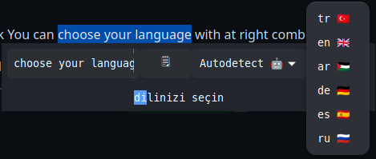
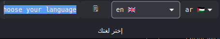
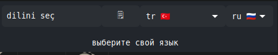

# Sellected Text Translation

## Dependices

`sudo apt install xsel xdotool`

`pip install -r requirements.txt`

## Usage

- You can translate any selleceted with one click

- You can choose your input and output language

- When give a shortcut to `cevir.sh` it gives a traslated text to your mouse cursor position.

- When press esc it close

- You can copy text from button or sellect from label

if Your language different you can change lange list from 

## Todo
- google(html) parsed translate (it is ready but it need improvment)
- deb package
- small setting ui

